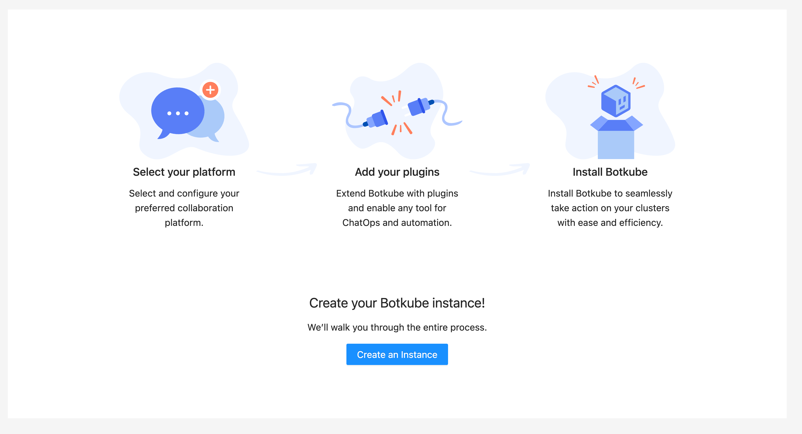
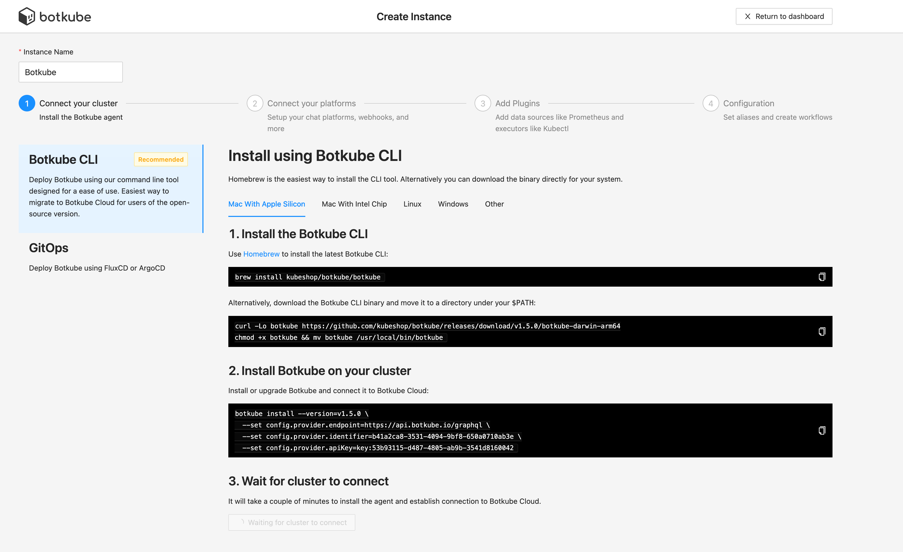
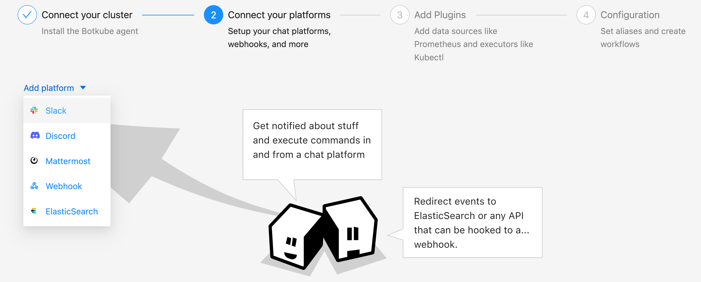
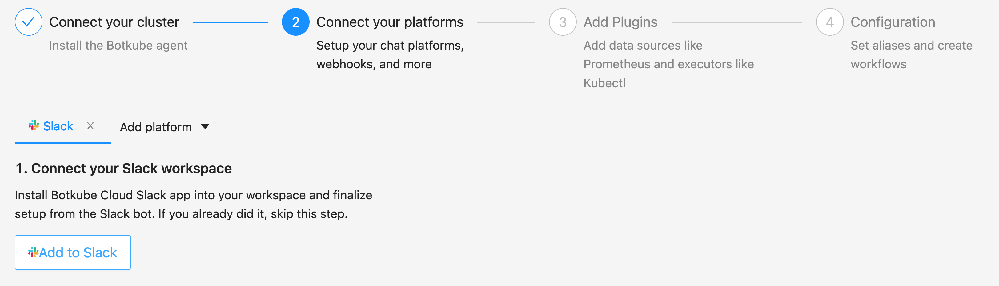
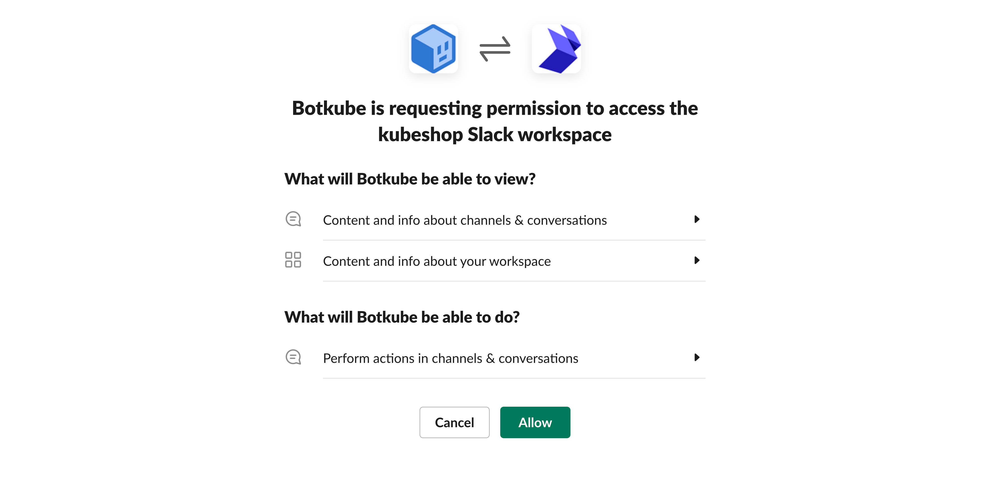
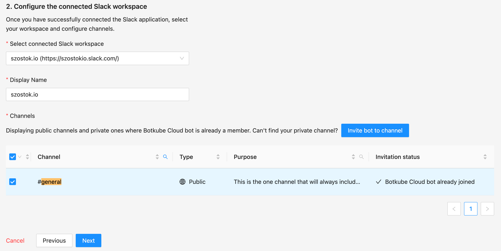
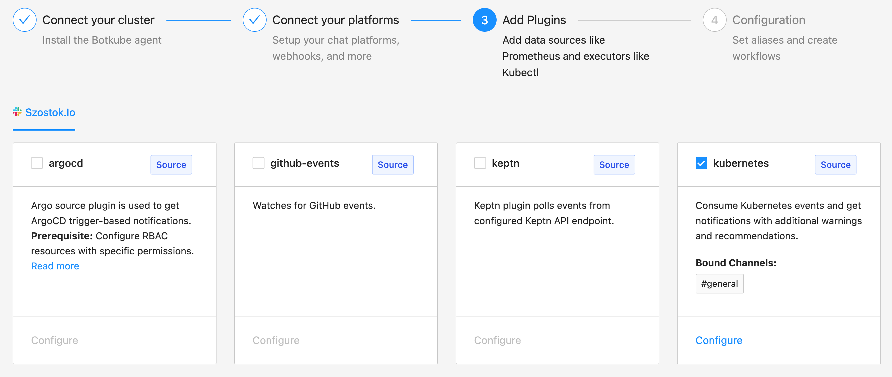
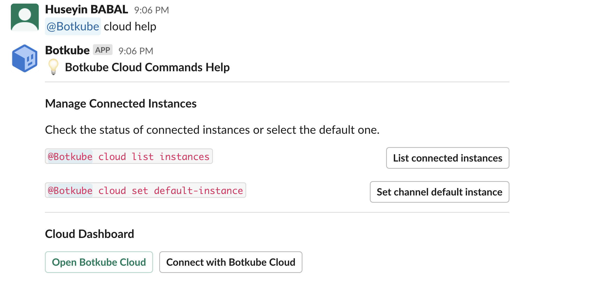
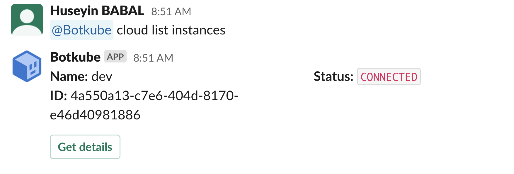

# Botkube Installation Tutorial

Welcome to the Botkube installation tutorial. Botkube is a tool that provides real-time notifications and interactive commands for Kubernetes events in your team's collaboration platforms. This guide will walk you through the installation process of Botkube on your Kubernetes cluster and integrating it with Slack and Microsoft Teams.

## Prerequisites

Before you begin the installation process, make sure you have the following prerequisites in place:

1. A running Kubernetes cluster that you want to monitor with Botkube.

2. `kubectl` command-line tool configured to communicate with your Kubernetes cluster.

3. Permissions to create custom resources and deploy resources in the cluster.

4. Access to your team's collaboration platform, either Slack or Microsoft Teams, with administrative privileges to add a bot or webhook.

Now, let's proceed with the installation and configuration of Botkube for your preferred collaboration platform.

## Installing Botkube in Slack

In this section, we will guide you through the steps to install and configure Botkube for Slack, enabling real-time notifications and interactive commands for Kubernetes events within your Slack workspace.
The Botkube Cloud App for Slack uses Botkube Cloud services to manage channels and route executor commands. This allows multi-cluster support without a need to create a dedicated Slack application for each cluster. Events and alerts are sent directly from your cluster to your Slack workspace for reliable, fast notifications.

## Prerequisites

- A Botkube Cloud account.

  You can try out the Botkube Cloud App for Slack for free by creating an account in the [Botkube Cloud app](https://app.botkube.io).

## Create a Botkube Cloud Instance with Cloud Slack

1. Go to Botkube Cloud [Web App](https://app.botkube.io/) and click on `New Instance` button.

   

2. Install Botkube Agent on your Kubernetes cluster by following the instructions on the page.

   

3. Click `Add platform` dropdown, and select `Slack` option.

   

4. Click `Add to Slack` button to add Cloud Slack integration to your Slack workspace.

   

5. Click `Allow` to grant permission for Botkube app to access your Slack workspace.

   

6. Provide the Slack app details as described follows and click `Next` button.

   - **Connected Slack Workspace:** Slack workspace that you granted permission in the previous step.
   - **Display Name:** Display name of the Cloud Slack configuration.
   - **Channels:** Slack channes where you can execute Botkube commands and receive notification.

   

7. Add plugins you want to enable in your Botkube instance and click `Next` button.

   

8. Include optional default command aliases and actions and click `Apply Changes` button to update Botkube Cloud instance.

   

## Using Botkube Cloud App for Slack

You can start using Botkube Cloud App for Slack by typing `@Botkube cloud help` in the Slack channel you configured in one of the previous steps.

### Listing Cloud Instances

You can list all the Botkube Cloud instances by typing `@Botkube cloud list instances` in the Slack channel, or click the button `List connected instances` in the help command response.
Besides the instance `name`, `ID`, and `status` in the list response, you can also click the `Get details` button to go to instance details on Botkube Cloud Dashboard.

### Setting Default Instances

Once a Botkube command is executed, it will be handled on target Kubernetes cluster specified with `--cluster-name` flag. This is an optional flag,
where if you have not specified it, Botkube Cloud will select the first instance. However, you can also achieve setting default instance with command `@Botkube cloud set default-instance {instance-id}`.

After this point, all of your commands will be executed on the default instance. Moreover, if you want to execute a command on all the target clusters, you can use `--all-clusters` flag.

## Cleanup

1. Go to Botkube Cloud instances page and click `Manage` button of the instance you want to remove.

   

2. Click `Delete instance` button, type instance name in the popup and click `Delete instance`.

   :::caution
   Remember to execute the displayed command to completely remove Botkube and related resources from your cluster.
   :::

   

## Installing Botkube in Microsoft Teams

In this section, we will guide you through the steps to install and configure Botkube for Microsoft Teams, allowing you to receive real-time Kubernetes event notifications and interact with your Kubernetes cluster directly from your Teams workspace.
