# Botkube Installation Tutorial

Welcome to the Botkube installation tutorial. Botkube is a tool that provides real-time notifications and interactive commands for Kubernetes events in your team's collaboration platforms. This guide will walk you through the installation process of Botkube on your Kubernetes cluster and integrating it with Slack and Microsoft Teams.

## Prerequisites

Before you begin the installation process, make sure you have the following prerequisites in place:

1. A running Kubernetes cluster that you want to monitor with Botkube.

2. `kubectl` command-line tool configured to communicate with your Kubernetes cluster.

3. Permissions to create custom resources and deploy resources in the cluster.

4. Access to your team's collaboration platform, either Slack or Microsoft Teams, with administrative privileges to add a bot or webhook.

Now, let's proceed with the installation and configuration of Botkube for your preferred collaboration platform.

## Installing Botkube in Slack

In this section, we will guide you through the steps to install and configure Botkube for Slack, enabling real-time notifications and interactive commands for Kubernetes events within your Slack workspace.
The Botkube Cloud App for Slack uses Botkube Cloud services to manage channels and route executor commands. This allows multi-cluster support without a need to create a dedicated Slack application for each cluster. Events and alerts are sent directly from your cluster to your Slack workspace for reliable, fast notifications.

## Prerequisites

- A Botkube Cloud account.

  You can try out the Botkube Cloud App for Slack for free by creating an account in the [Botkube Cloud app](https://app.botkube.io).

## Create a Botkube Cloud Instance with Cloud Slack

1. Go to Botkube Cloud [Web App](https://app.botkube.io/) and click on `New Instance` button.

   

2. Install Botkube Agent on your Kubernetes cluster by following the instructions on the page.

   

3. Click `Add platform` dropdown, and select `Slack` option.

   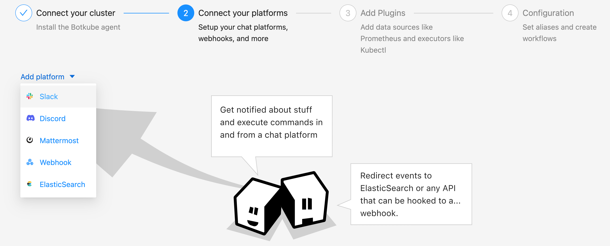

4. Click `Add to Slack` button to add Cloud Slack integration to your Slack workspace.

   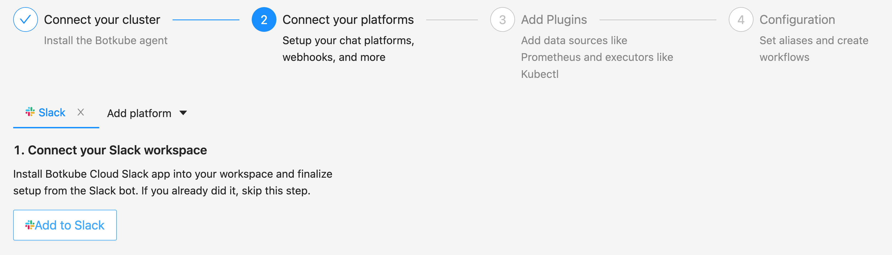

5. Click `Allow` to grant permission for Botkube app to access your Slack workspace.

   

6. Provide the Slack app details as described follows and click `Next` button.

   - **Connected Slack Workspace:** Slack workspace that you granted permission in the previous step.
   - **Display Name:** Display name of the Cloud Slack configuration.
   - **Channels:** Slack channes where you can execute Botkube commands and receive notification.

   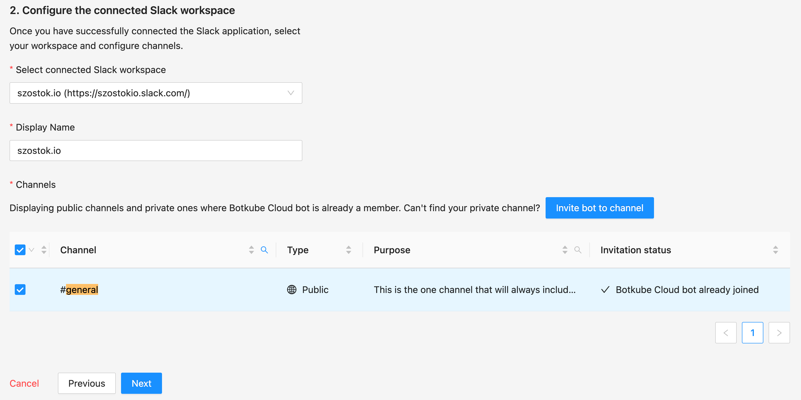

7. Add plugins you want to enable in your Botkube instance and click `Next` button.

   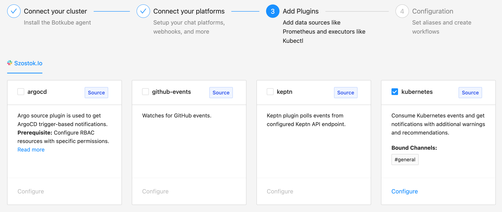

8. Include optional default command aliases and actions and click `Apply Changes` button to update Botkube Cloud instance.

   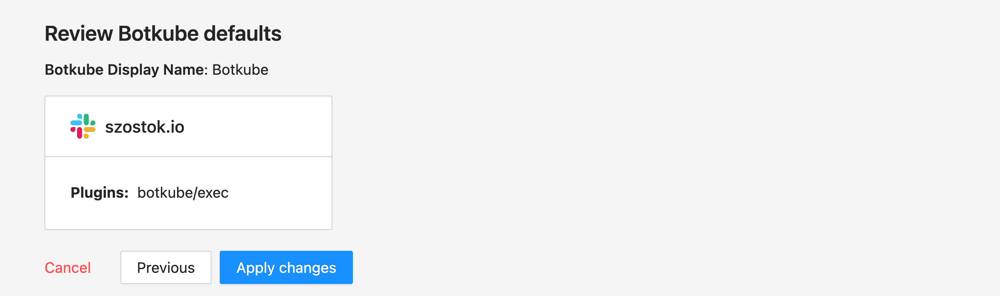

## Using Botkube Cloud App for Slack

You can start using Botkube Cloud App for Slack by typing `@Botkube cloud help` in the Slack channel you configured in one of the previous steps.

### Listing Cloud Instances

You can list all the Botkube Cloud instances by typing `@Botkube cloud list instances` in the Slack channel, or click the button `List connected instances` in the help command response.
Besides the instance `name`, `ID`, and `status` in the list response, you can also click the `Get details` button to go to instance details on Botkube Cloud Dashboard.

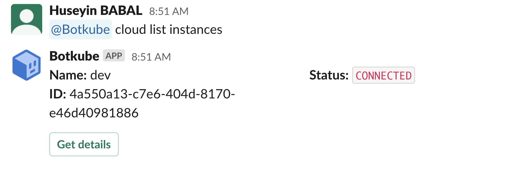

### Setting Default Instances

Once a Botkube command is executed, it will be handled on target Kubernetes cluster specified with `--cluster-name` flag. This is an optional flag,
where if you have not specified it, Botkube Cloud will select the first instance. However, you can also achieve setting default instance with command `@Botkube cloud set default-instance {instance-id}`.

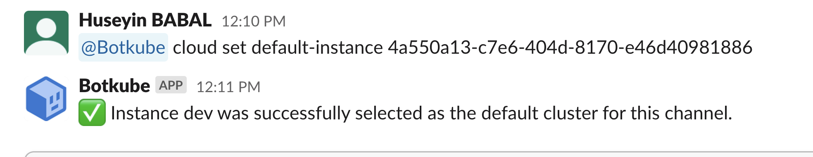

After this point, all of your commands will be executed on the default instance. Moreover, if you want to execute a command on all the target clusters, you can use `--all-clusters` flag.

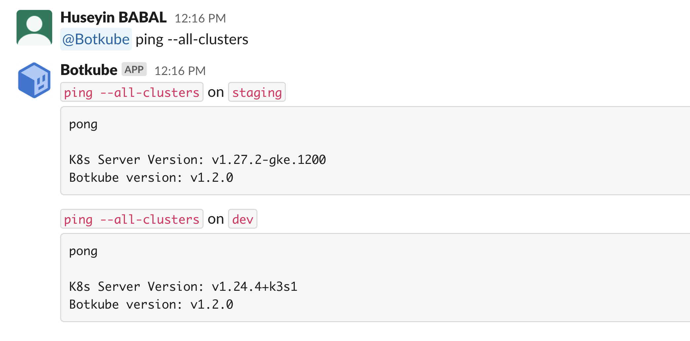

## Cleanup

1. Go to Botkube Cloud instances page and click `Manage` button of the instance you want to remove.

   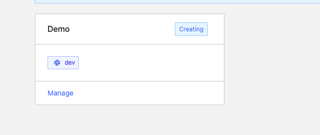

2. Click `Delete instance` button, type instance name in the popup and click `Delete instance`.

   :::caution
   Remember to execute the displayed command to completely remove Botkube and related resources from your cluster.
   :::

   

## Installing Botkube in Microsoft Teams

In this section, we will guide you through the steps to install and configure Botkube for Microsoft Teams, allowing you to receive real-time Kubernetes event notifications and interact with your Kubernetes cluster directly from your Teams workspace.

## Prerequisites

- A Botkube Cloud account.

  You can try out the Botkube Cloud Microsoft Teams app for free by creating an account in the [Botkube Cloud app](https://app.botkube.io).

## Create a Botkube Cloud Instance with Microsoft Teams

### Connect Botkube Cloud to your Kubernetes cluster

1. Go to Botkube Cloud [Web App](https://app.botkube.io/) and click on `New Instance` button.

   

1. Install Botkube Agent on your Kubernetes cluster by following the instructions on the page.

   

1. Click `Add platform` dropdown, and select `Teams` option.

   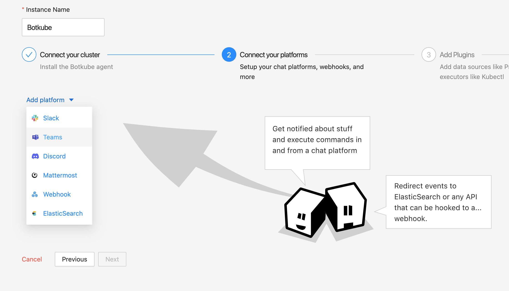

Proceed with the next section.

### Install Botkube app to your Microsoft Teams organization and add it to your team

1. Download the Botkube Cloud Microsoft Teams app by clicking the `Download Botkube App for Teams` button.

   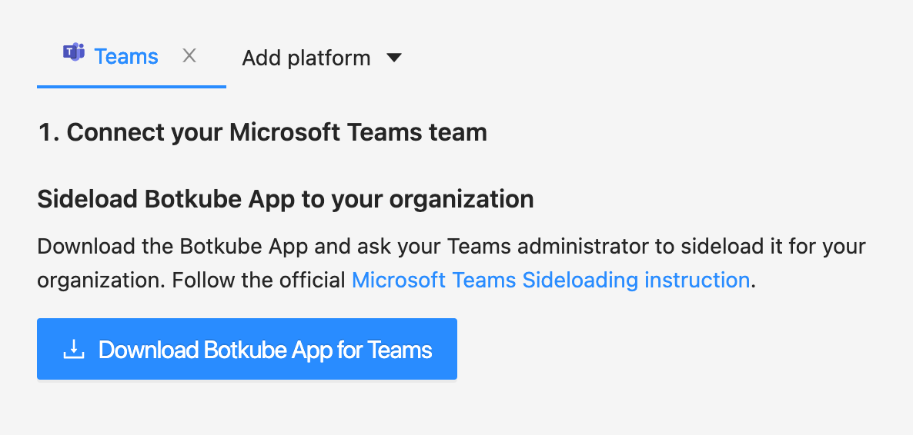

1. Sideload the Botkube app to your Microsoft Teams organization via Teams Admin Center, following the [official documentation](https://learn.microsoft.com/en-us/microsoftteams/teams-custom-app-policies-and-settings#upload-a-custom-app-using-teams-admin-center).

   :::info
   This step requires administrator permissions on your Microsoft Teams organization. Sideloading app is needed only once for the whole organization.
   :::

   - Ensure the Botkube app is allowed for the organization in the [Teams Admin Center](https://admin.teams.microsoft.com/policies/manage-apps)

   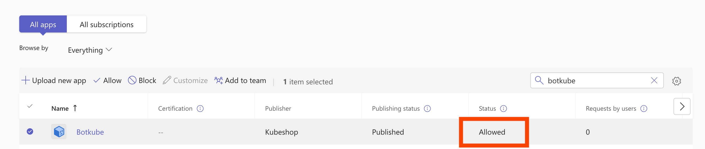

1. Add the Botkube app to your team.

   1. In your Microsoft Teams application, navigate to the **Apps** tab.
   1. Select the **Built for your organization** tab.
   1. On the Botkube app card, click on the **Add** button.

      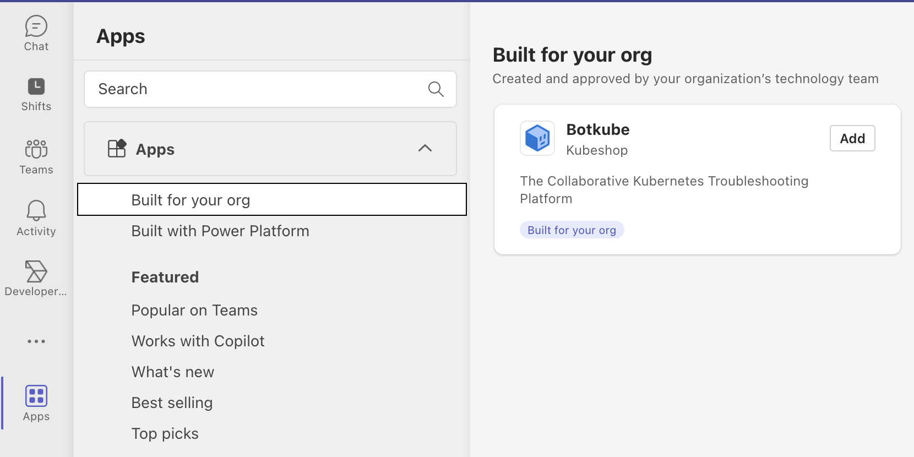

   1. Click the **Add to a team** button.

      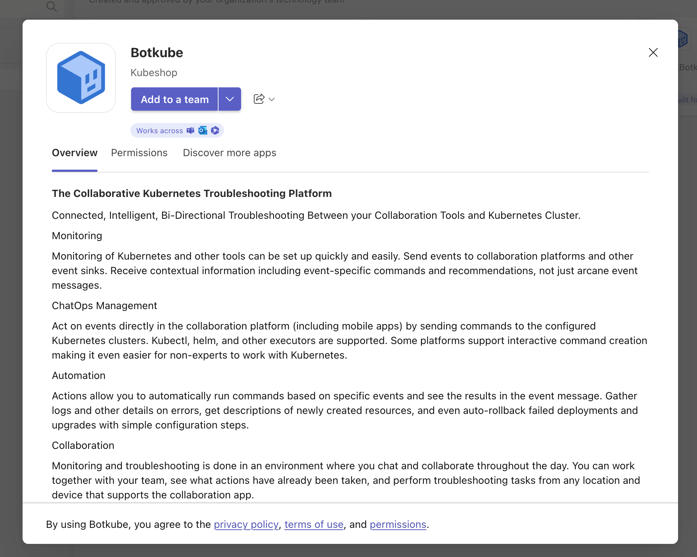

   1. Select the team and default channel, where you'll get the welcome message.

      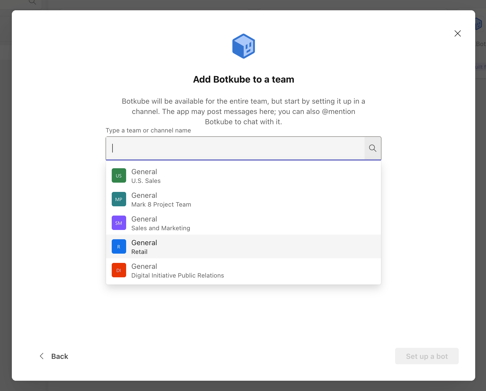

   1. Click the **Set up a bot** button.

Once the Botkube app is added to your team, you'll receive a welcome message.

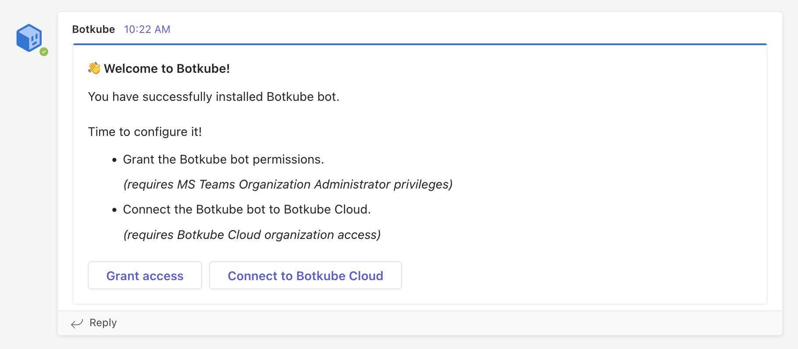

Proceed with the next section.

### Grant permissions for Botkube app

:::info
This step requires administrator permissions on your Microsoft Teams organization. Granting permissions is needed only once for the whole organization.
:::

1. Click on the **Grant access** button.
1. Select your Microsoft account.

   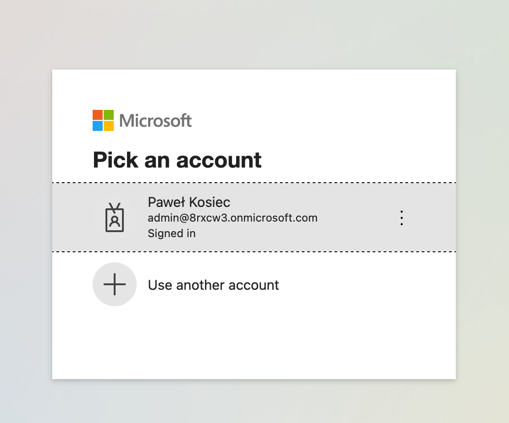

1. Click the **Accept** button.

   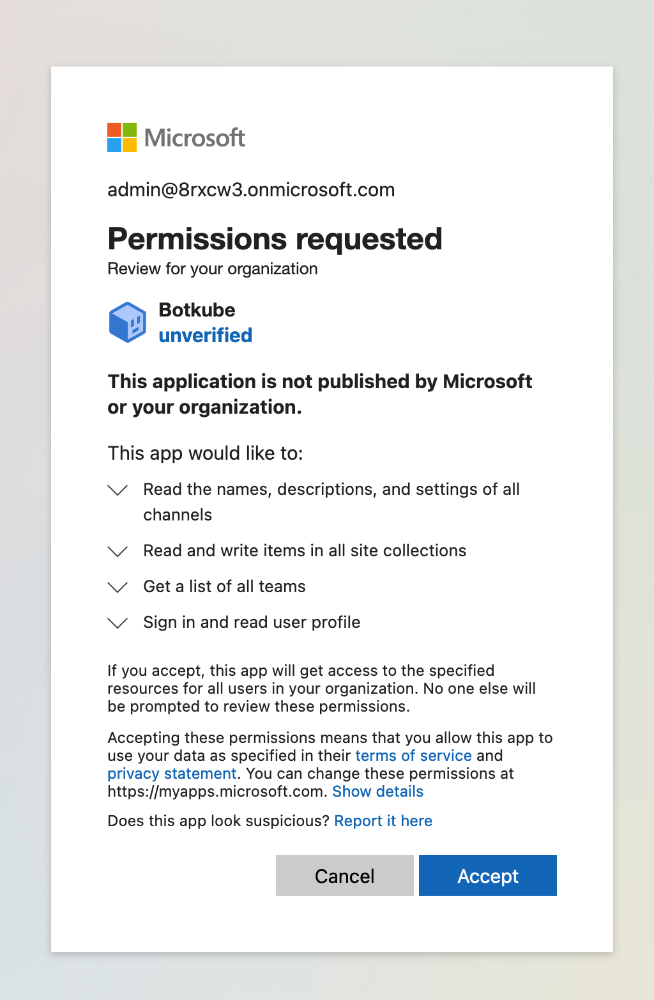

1. You will be redirected to the confirmation page.

   

Close the page and proceed with the next section.

### Connect your team to Botkube Cloud

Go back to the Microsoft Teams app channel, where you received the welcome message.

1. Click the **Connect to Botkube Cloud** button in the welcome message.
1. Log in to Botkube Cloud, if you haven't already. Ensure that you selected the correct organization, where you want to connect your team.
1. Click the **Connect** button.

   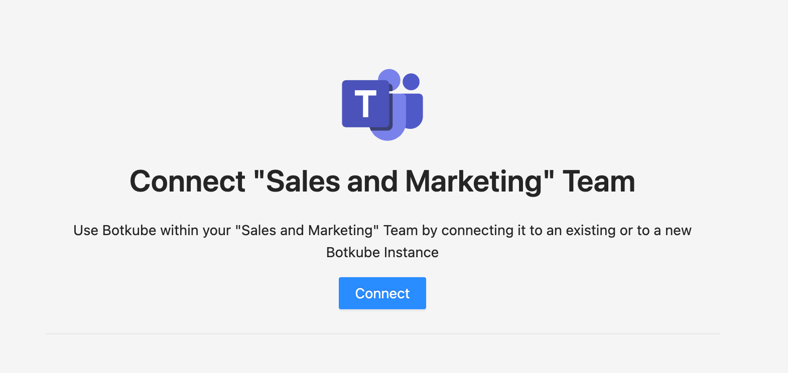

1. You will see a confirmation page.

   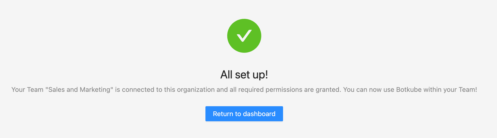

Close the page and proceed with the next section.

### Finalize Botkube Cloud instance configuration

Go back to the Botkube Cloud instance creation.

1. In step 2, select your connected team and provide other details.

   - **Connected Microsoft Teams team:** Teams team that you connected in the previous section.
   - **Display Name:** Display name of the Microsoft Teams team configuration.
   - **Channels:** Teams channels where you can execute Botkube commands and receive notification.

   

2. Add plugins you want to enable in your Botkube instance and click `Next` button.

   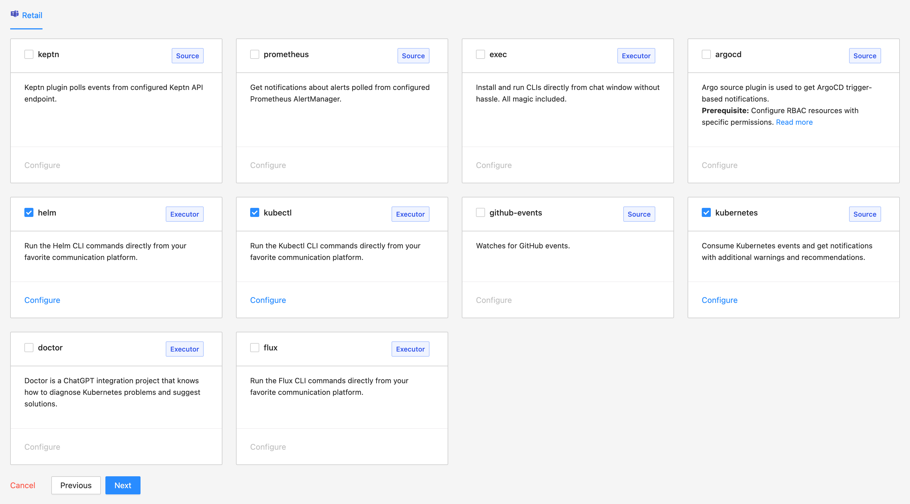

3. Include optional default command aliases and actions and click `Apply Changes` button to update Botkube Cloud instance.

   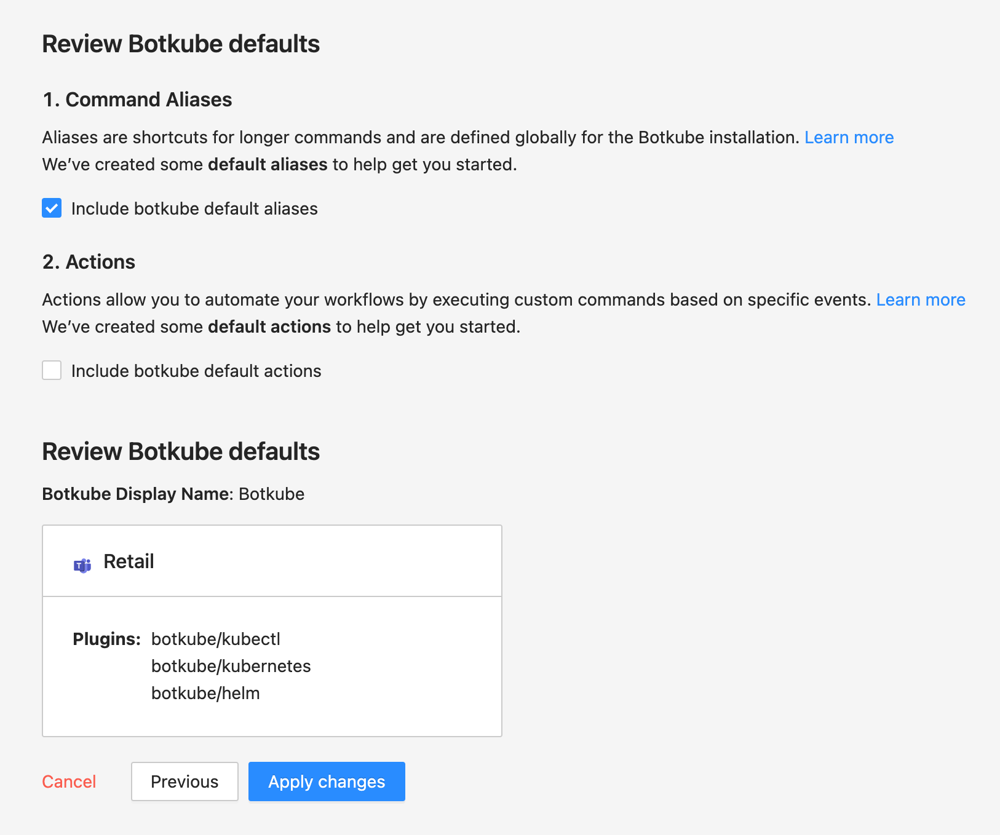

## Using Botkube Cloud Microsoft Teams App

You can start using Botkube Cloud Microsoft Teams by typing `@Botkube cloud help` in one of the channels in the team you configured in one of the previous steps.

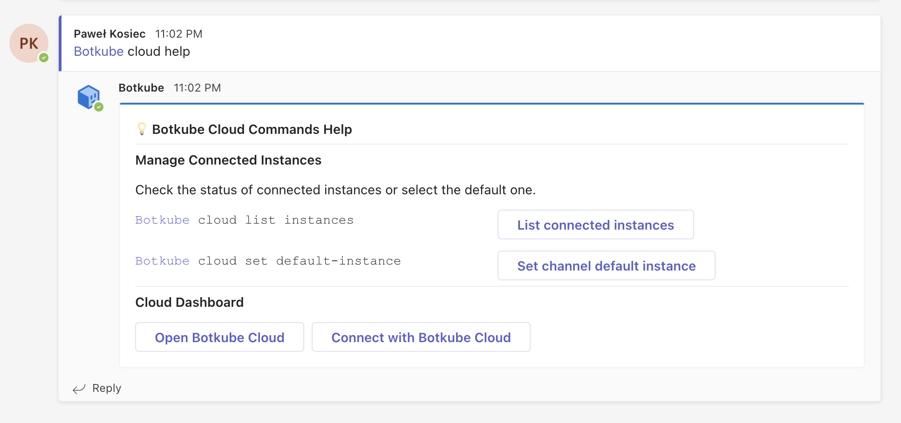

### Listing Cloud Instances

You can list all your Botkube Cloud instances by typing `@Botkube cloud list` in the Microsoft Teams channel, or click the button `List connected instances` in the help command response. Besides the instance `name`, `ID`, and `status` in the list response, you can also click the `Get details` button to go to instance details on Botkube Cloud Dashboard.

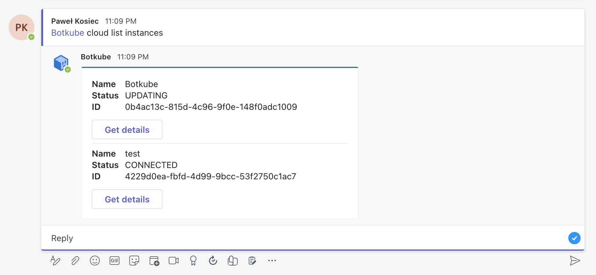

### Setting Default Instance

Once a Botkube command is executed, it will be handled on target Kubernetes cluster specified with `--cluster-name` flag. This is an optional flag,
where if you have not specified it, Botkube Cloud will select the first instance. However, you can also achieve setting default instance with command `@Botkube cloud set default-instance`.

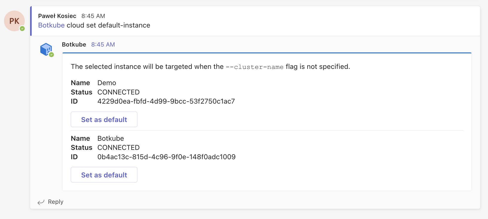

After this point, all of your commands will be executed on the default instance. Moreover, if you want to execute a command on all the target clusters, you can use `--all-clusters` flag.

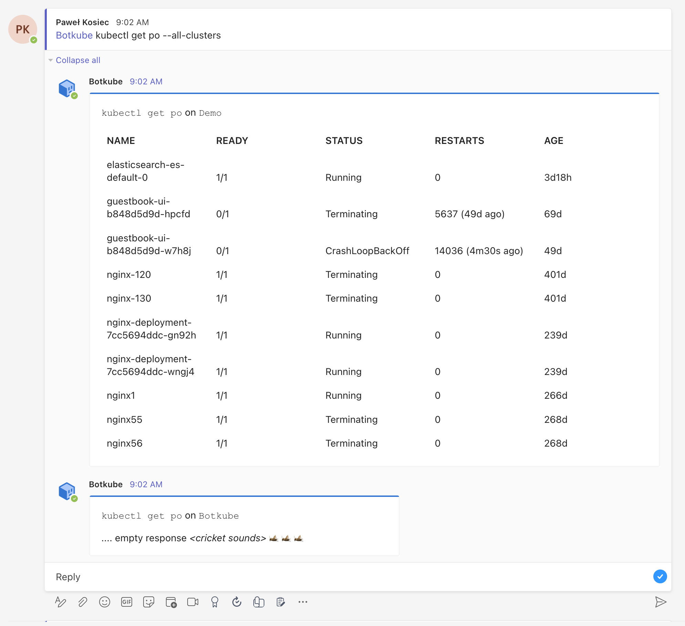

## Cleanup

1. Go to Botkube Cloud instances page and click `Manage` button of the instance you want to remove.

   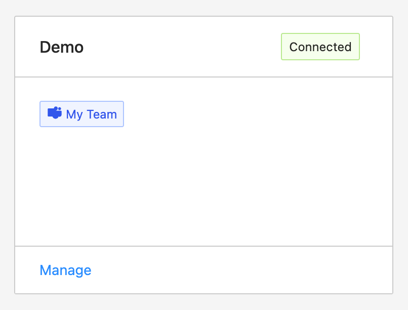

2. Click `Delete instance` button, type instance name in the popup and click `Delete instance`.

   :::caution
   Remember to execute the displayed command to completely remove Botkube and related resources from your cluster.
   :::

   

## Caveats

### RBAC `ChannelName` mapping

Same as other communication platforms, Botkube Cloud Microsoft Teams app supports RBAC along with [all mappings](../../configuration/rbac.md#mapping-types).
However, because of the Microsoft Teams API limitation, for the default team channel the `ChannelName` is always `General`, regardless of the actual localized channel name.
